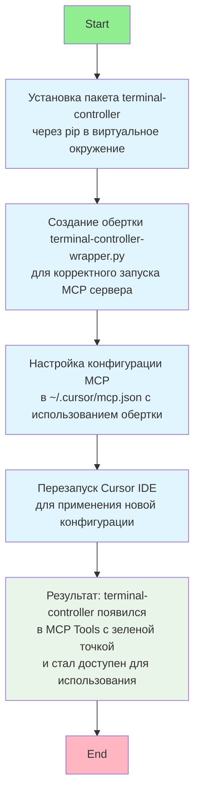

# Terminal Controller Setup - Mermaid BPMN

## Описание процесса:

1. **Start Event**: Начало процесса установки
2. **Task 1**: Установка пакета через pip
3. **Task 2**: Создание Python обертки
4. **Task 3**: Настройка конфигурации MCP
5. **Task 4**: Перезапуск IDE
6. **End Event**: Успешная установка

## Технические детали:

- **Виртуальное окружение**: Python venv
- **Пакет**: terminal-controller
- **Обертка**: terminal-controller-wrapper.py
- **Конфигурация**: ~/.cursor/mcp.json
- **Результат**: Зеленая точка в MCP Tools

