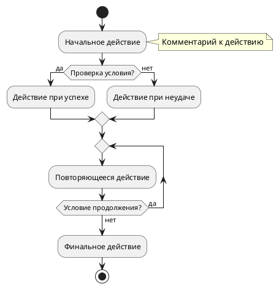
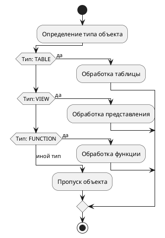

# UML Диаграммы в проекте Vuege

**Псевдонимы**: документация UML, руководство по диаграммам

## Описание

Этот раздел содержит UML диаграммы для проекта Vuege, созданные с использованием PlantUML. Диаграммы обеспечивают визуальное представление архитектуры системы, доменной модели и процессов взаимодействия компонентов.

## Инструменты

### PlantUML
- **Расширение**: PlantUML (jebbs) для VS Code/Cursor
- **Лицензия**: GPL v3 (открытый исходный код)
- **Стоимость**: Бесплатно
- **Назначение**: UML диаграммы классов, последовательности, компонентов

### BPMN Sketch Miner
- **Расширение**: BPMN Sketch Miner (s-v-o) для VS Code/Cursor
- **Лицензия**: MIT (открытый исходный код)
- **Стоимость**: Бесплатно
- **Назначение**: BPMN диаграммы для бизнес-процессов

## Структура диаграмм

```
docs/schemes/uml/
├── class-diagrams/           # Диаграммы классов
│   ├── domain-model.puml     # Основная доменная модель
│   ├── organizational-units.puml  # Организационные единицы
│   ├── people-positions.puml # Люди и должности
│   └── reporting-system.puml # Система отчётности
├── sequence-diagrams/        # Диаграммы последовательности
│   ├── report-generation.puml # Процесс генерации отчётов
│   ├── data-import.puml      # Процесс импорта данных
│   └── user-authentication.puml # Аутентификация пользователей
├── component-diagrams/       # Диаграммы компонентов
│   ├── system-architecture.puml # Архитектура системы
│   ├── frontend-backend.puml # Взаимодействие Frontend/Backend
│   └── mcp-integration.puml  # Интеграция MCP серверов
└── README.md                 # Эта документация
```

## Порядок формирования записи в файле

### Система нумерации диаграмм
Диаграммы именуются по шаблону: `[тип-диаграммы]-[назначение].puml`
- **class-diagrams** - для диаграмм классов
- **sequence-diagrams** - для диаграмм последовательности
- **component-diagrams** - для диаграмм компонентов

### Структура PlantUML файла


### Допустимые конструкции PlantUML

#### Для диаграмм активности (Activity Diagrams)
**Источник**: [PlantUML Activity Diagram Beta](https://plantuml.com/ru/activity-diagram-beta)

##### Основные элементы:
- **`start`** - начальное состояние активности
- **`stop`** - конечное состояние активности  
- **`end`** - конечное состояние потока
- **`kill`** или **`detach`** - быстрый стоп без значков

##### Действия:
- **`:действие;`** - простое действие (начинается с `:` и заканчивается `;`)
- **`:действие с\\nпереносом строки;`** - многострочные действия

##### Условия (оператор if):
```plantuml
if (условие) then (да)
    :действие1;
else (нет)
    :действие2;
endif
```

##### Множественные условия (elseif):
```plantuml
if (условие1) then (вариант1)
    :действие1;
elseif (условие2) then (вариант2)
    :действие2;
else (иной вариант)
    :действие3;
endif
```

##### Циклы repeat:
```plantuml
repeat
    :действие1;
    :действие2;
repeat while (условие) is (да) not (нет)
```

##### Комментарии (notes):
- **`note right: текст`** - комментарий справа от элемента
- **`note left: текст`** - комментарий слева от элемента
- **`note top: текст`** - комментарий сверху от элемента
- **`note bottom: текст`** - комментарий снизу от элемента

##### Прагмы и настройки:
- **`!pragma useVerticalIf on`** - вертикальное отображение условий
- **`!pragma useVerticalIf off`** - горизонтальное отображение условий

#### Для диаграмм классов (Class Diagrams)
- **`class ИмяКласса`** - определение класса
- **`interface ИмяИнтерфейса`** - определение интерфейса
- **`enum ИмяПеречисления`** - определение перечисления
- **`package ИмяПакета`** - группировка элементов

#### Для диаграмм последовательности (Sequence Diagrams)
- **`participant Имя`** - участник диаграммы
- **`actor Имя`** - актор
- **`->`** - синхронное сообщение
- **`-->`** - асинхронное сообщение
- **`->>`** - ответное сообщение

### Принципы ведения
1. **Единообразие стилей** - использование единой темы и цветовой схемы
2. **Читаемость** - диаграммы должны быть понятными и информативными
3. **Актуальность** - регулярное обновление при изменении архитектуры
4. **Версионный контроль** - все диаграммы хранятся в текстовом формате
5. **Совместимость** - использование только поддерживаемых конструкций PlantUML

## Список диаграмм

### Диаграммы классов

#### domain-model.puml
**Назначение**: Основная доменная модель системы Vuege
**Содержание**: 
- Основные сущности (OrganizationalUnit, Person, Position)
- Связи между сущностями
- Перечисления типов
- Методы классов

**Обновление**: При изменении доменной модели

#### organizational-units.puml
**Назначение**: Детальная модель организационных единиц
**Содержание**:
- Иерархия организационных единиц
- Типы организаций
- Процессы трансформации

#### people-positions.puml
**Назначение**: Модель людей и должностей
**Содержание**:
- Связи Person-Position
- Исторические данные
- Типы должностей

#### reporting-system.puml
**Назначение**: Система генерации отчётов
**Содержание**:
- Типы отчётов
- Процессы генерации
- Форматы экспорта

### Диаграммы последовательности

#### report-generation.puml
**Назначение**: Процесс генерации отчётов
**Содержание**:
- Взаимодействие компонентов
- Асинхронная обработка
- Обработка ошибок

#### data-import.puml
**Назначение**: Процесс импорта данных
**Содержание**:
- Валидация файлов
- Обработка данных
- Сохранение в БД

### Диаграммы компонентов

#### system-architecture.puml
**Назначение**: Общая архитектура системы
**Содержание**:
- Frontend компоненты
- Backend сервисы
- Инфраструктурные компоненты
- MCP серверы

#### frontend-backend.puml
**Назначение**: Взаимодействие Frontend/Backend
**Содержание**:
- GraphQL API
- REST API
- Аутентификация
- Кэширование

## Работа с диаграммами

### Просмотр диаграмм
1. Откройте файл `.puml` в Cursor IDE
2. Убедитесь, что установлено расширение PlantUML
3. Нажмите `Ctrl+Shift+P` и выберите "PlantUML: Preview Current Diagram"
4. Диаграмма откроется в отдельном окне

### Редактирование диаграмм
1. Отредактируйте текст в файле `.puml`
2. Сохраните файл
3. Диаграмма автоматически обновится в окне предварительного просмотра

### Экспорт диаграмм
1. В окне предварительного просмотра
2. Нажмите правой кнопкой мыши
3. Выберите "Export as PNG/SVG/PDF"

### Генерация всех диаграмм
```bash
# Установка PlantUML (если не установлен)
sudo apt install plantuml

# Генерация всех диаграмм
cd docs/schemes/uml/
find . -name "*.puml" -exec plantuml {} \;
```

## Интеграция с документацией

### Ссылки в project.md
```markdown
## Архитектура системы

Подробные диаграммы архитектуры доступны в:
- [Доменная модель](docs/schemes/uml/class-diagrams/domain-model.puml)
- [Архитектура системы](docs/schemes/uml/component-diagrams/system-architecture.puml)
- [Процесс генерации отчётов](docs/schemes/uml/sequence-diagrams/report-generation.puml)
```

### Обновление документации
При изменении диаграмм необходимо:
1. Обновить соответствующие разделы в `docs/main/project.md`
2. Добавить запись в `docs/main/changelog.md`
3. Обновить эту документацию при необходимости

## Стандарты оформления

### Цветовая схема
- **Классы**: #E3F2FD (светло-синий)
- **Перечисления**: #F3E5F5 (светло-фиолетовый)
- **Компоненты**: #E8F5E8 (светло-зеленый)
- **Интерфейсы**: #FFF3E0 (светло-оранжевый)
- **Базы данных**: #F3E5F5 (светло-фиолетовый)

### Примеры использования конструкций

#### Диаграмма активности с циклами и условиями:


#### Диаграмма активности с множественными условиями:


### Стили
- **Тема**: plain (минималистичная)
- **Фон**: белый (#FFFFFF)
- **Шрифт**: 12pt для читаемости
- **Границы**: четкие, контрастные

### Именование
- **Классы**: PascalCase (OrganizationalUnit)
- **Методы**: camelCase (createReport)
- **Перечисления**: UPPER_CASE (STATE, GOVERNMENT)
- **Файлы**: kebab-case (domain-model.puml)

## Полезные ресурсы

### Документация PlantUML
- [Официальная документация](https://plantuml.com/)
- [Справочник по синтаксису](https://plantuml.com/guide)
- [Примеры диаграмм](https://plantuml.com/examples)

### Интеграция с VS Code/Cursor
- [PlantUML Extension](https://marketplace.visualstudio.com/items?itemName=jebbs.plantuml)
- [Настройка расширения](https://plantuml.com/vscode)

### Лучшие практики
- [UML Best Practices](https://www.uml-diagrams.org/best-practices.html)
- [PlantUML Style Guide](https://plantuml.com/style-guide)

### Правила использования конструкций

#### Для диаграмм активности:
1. **Условия**: Используйте `if/then/else/endif` для ветвления логики
2. **Циклы**: Используйте `repeat/repeat while` для повторяющихся действий
3. **Комментарии**: Размещайте `note right/left/top/bottom` для пояснений
4. **Прагмы**: Используйте `!pragma useVerticalIf on` для вертикального отображения условий
5. **Завершение**: Всегда используйте `stop` или `end` для завершения потока

#### Ограничения и рекомендации:
- **Избегайте `backward`** - не поддерживается в новых версиях PlantUML
- **Используйте `note right`** вместо `note bottom right` для совместимости
- **Проверяйте синтаксис** перед коммитом: `plantuml -checkonly файл.puml`
- **Тестируйте диаграммы** в разных версиях PlantUML для совместимости
